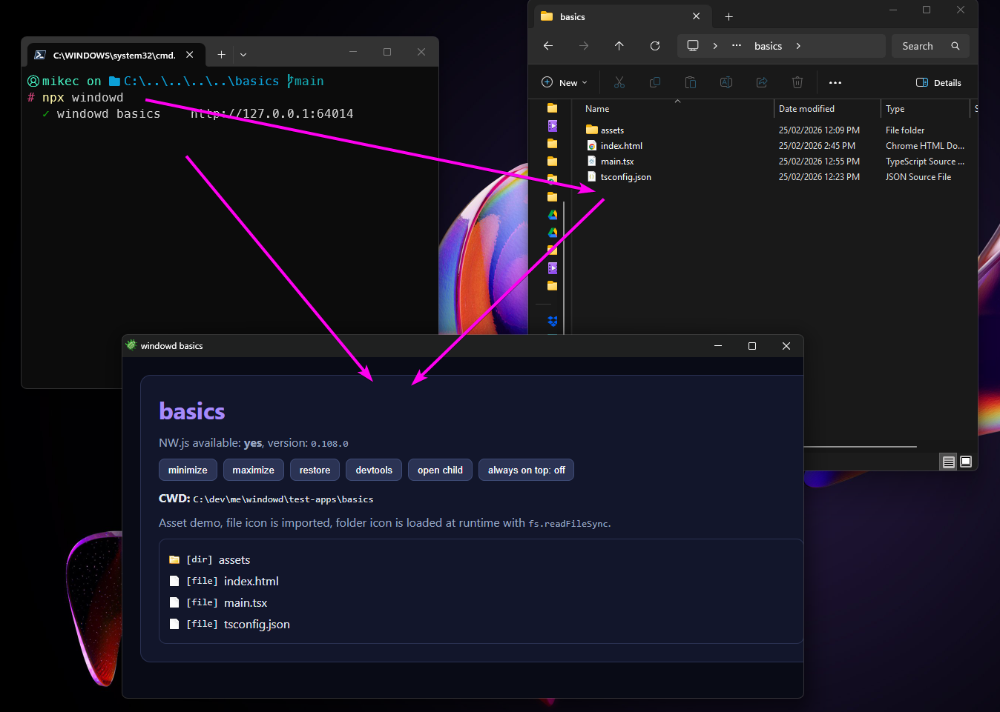

# windowd

> Wrap any Vite project in an NW.js app shell with direct renderer Node.js access.



## WARNING

This project is intentionally **unsafe by default**.

Renderer code gets unrestricted Node.js access. Any script running in your app can read/write files, run shell commands, access network resources, and perform other privileged operations on your machine.

Only run trusted code with `windowd`.

```bash
npx windowd
```

## What this gives you

- Single command to run any `index.html`/Vite project as a desktop app
- Full Node.js APIs in renderer code (`require`, `process`, `node:*`)
- Vite dev server + HMR
- Auto setup for common zero-config workflows:
  - auto-generated Vite config wrapper
  - auto-generated `tsconfig.json` when missing
  - auto-install `@types/nw.js` for TypeScript NW API types
  - `node:*` import shim for NW runtime
  - optional `windowd-config.ts` for NW manifest/window overrides

## How it works

1. Run `windowd` in a project directory
2. Vite starts on localhost
3. A temporary NW host app is generated and launched
4. Your app loads in NW with Node enabled for remote page

When the app window closes, the CLI exits and Vite is shut down.

## Usage

```bash
# inside your project directory
npx windowd

# options
npx windowd --width 1440 --height 900
npx windowd --title "My App"
npx windowd --debug
npx windowd --init
```

In this repo, demo apps live under `test-apps/`:

- `test-apps/basics` shows typed `globalThis.nw` usage
- `test-apps/config-demo` shows `windowd-config.ts` overrides

## Window title and icon

windowd automatically picks up the title and icon from your project so the desktop window feels native without any configuration.

**Title** - resolved in priority order:

1. `--title` CLI flag
2. `windowd.title` in `package.json`
3. `displayName` in `package.json`
4. `name` in `package.json`
5. `<title>` tag in `index.html`
6. Directory name as final fallback

**Icon** - resolved in priority order:

1. `window.icon` set in `windowd-config.ts`
2. `<link rel="icon">` (or `<link rel="shortcut icon">`) in `index.html` - PNG, ICO, JPG supported (SVG is skipped)
3. `favicon.ico` / `favicon.png` / `favicon.jpg` in the project root or `public/`
4. windowd's built-in default icon ([application_xp](https://github.com/legacy-icons/famfamfam-silk) from famfamfam-silk)

## Optional config

Create `windowd-config.ts` in your project root to tweak NW settings.

```ts
export default {
  nw: {
    window: {
      frame: false,
      always_on_top: false,
    },
    chromiumArgs: "--disable-background-timer-throttling",
    nodeRemote: ["<all_urls>"],
  },
};
```

You can also provide `nw.manifest` to override extra NW manifest fields. Core runtime keys (`name`, `main`, `node-main`) are protected and cannot be overridden.

### `--init`

`--init` creates a minimal `tsconfig.json` if missing, or validates an existing one
and warns if required Node + Vite settings are missing.

## DevTools

- Right-click -> `Inspect / DevTools`
- Keyboard: `F12` or `Ctrl+Shift+I` (`Cmd+Shift+I` on macOS)

## Requirements

- Node.js >= 18 or Bun >= 1.0
- NW.js runtime is downloaded via the `nw` package (SDK flavor for DevTools)

## Notes

- This is intentionally an unrestricted desktop model, renderer code can use Node APIs.
- The included `test-app` demonstrates:
  - PNG import via Vite
  - runtime file loading with `fs.readFileSync`
  - React + HMR behavior in NW
